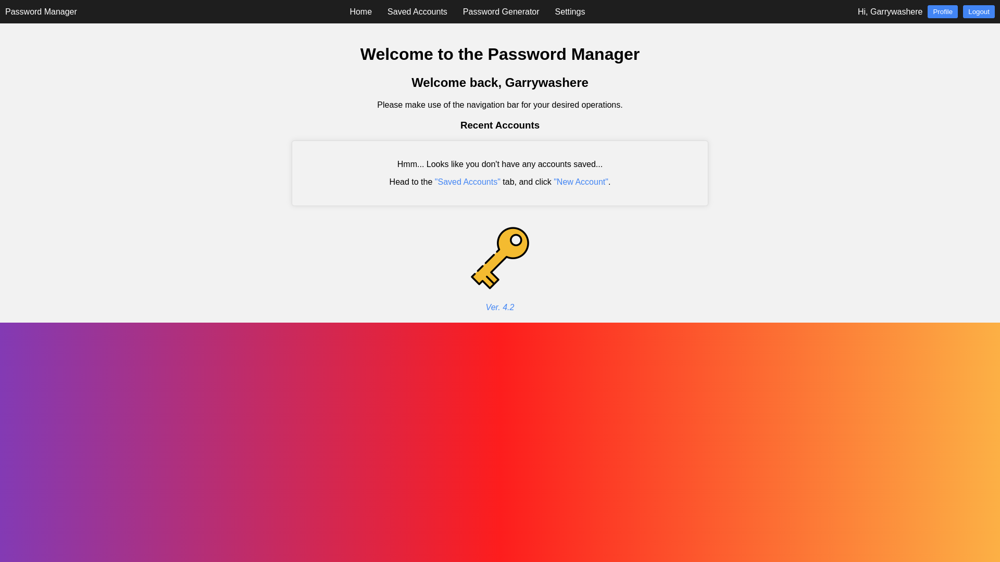

# 🔑 Password Manager Project


## 👀 Overview

This Python-based Password Manager is designed as part of the OCR Computer Science H446 programming project. The goal of this project is to create a secure and user-friendly password manager to help users manage their passwords effectively.



## 💡 Features

-   **User Authentication:** Allows users to create an account with a unique username and a secure password.
-   **Password Storage:** Safely stores and encrypts user passwords.
-   **Password Generation:** Provides a tool to generate strong, random passwords.
-   **Data Security:** Implements secure practices for storing and handling sensitive information.
-   **User Interface:** A simple and intuitive web interface for user interaction.
-   **Local Storage:** Provides peace of mind when data is stored locally completely under the users control.

## ⚙️ Requirements

-   Docker
-   Git
-   Python (3.10 or above)
-   argon2-cffi==23.1.0
-   Flask==3.0.2
-   gunicorn==21.2.0
-   Web Browser

That's it

## 🐳 Installation - Docker (Recommended)

1. Clone the repository:

    ```bash
    git clone https://github.com/garrywashere/password-manager.git
    ```

2. Navigate to the project directory:

    ```bash
    cd password-manager
    ```

3. Build the Docker image:

    ```bash
    docker build -t password-manager:latest .
    ```

4. Run the Docker image:

    ```bash
    docker run -d --name password-manager -p 8080:8080
    ```

5. Proceed to [Usage](#-usage)

## 🛠️ Installation - Bare Metal

1. Clone the repository:

    ```bash
    git clone https://github.com/garrywashere/password-manager.git
    ```

2. Navigate to the project directory:

    ```bash
    cd password-manager
    ```

3. Initiate the virtual environment:

    ```bash
    python -m venv venv
    ```

4. Enter the virtual envrionment

    ```bash
    source venv/bin/activate
    ```

5. Install required libraries from requirements.txt

    ```bash
    python -m pip install -r requirements.txt
    ```

6. Run main.py

    ```bash
    python main.py
    ```

7. Proceed to [Usage](#-usage)

## 🚀 Usage

1. Navigate to `https://127.0.0.1:8080/`

2. Create an account by pressing 'Login' in the top right, then 'Create Account'

3. Go through the TOTP enrollment process

4. Once you're logged in, use the top navigation bar to select different functions

5. Enjoy!


