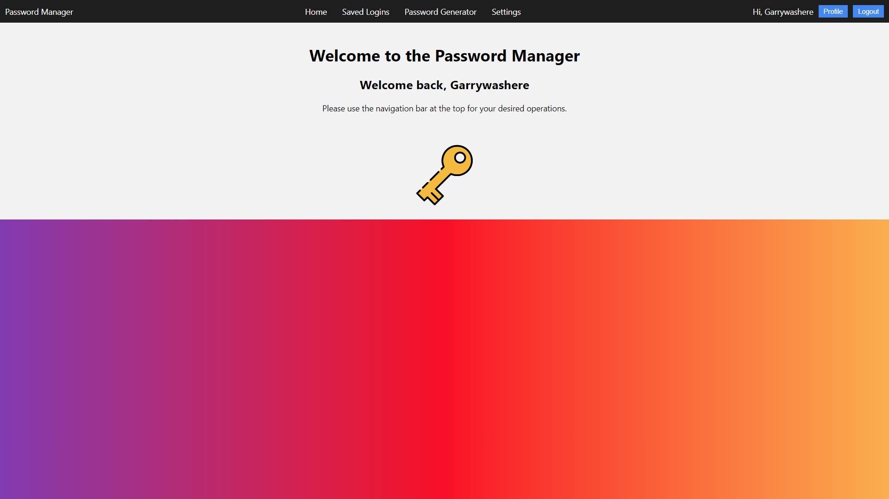

# Password Manager Project


## Overview

This Python-based Password Manager is designed as part of the OCR Computer Science H446 programming project. The goal of this project is to create a secure and user-friendly password manager to help users manage their passwords effectively.



## Features

- **User Authentication:** Allows users to create an account with a unique username and a secure password.
- **Password Storage:** Safely stores and encrypts user passwords.
- **Password Generation:** Provides a tool to generate strong, random passwords.
- **Data Security:** Implements secure practices for storing and handling sensitive information.
- **User Interface:** A simple and intuitive web interface for user interaction.
- **Local Storage:** Provides peace of mind when data is stored locally completely under the users control.

## Requirements
- python==3.10.0
- argon2-cffi==23.1.0
- argon2-cffi-bindings==21.2.0
- blinker==1.7.0
- cffi==1.16.0
- click==8.1.7
- Flask==3.0.2
- inquirerpy==0.3.4
- itsdangerous==2.1.2
- Jinja2==3.1.3
- MarkupSafe==2.1.5
- pfzy==0.3.4
- prompt-toolkit==3.0.43
- pycparser==2.21
- wcwidth==0.2.13
- Werkzeug==3.0.1


## Installation

1. Clone the repository:

   ```bash
   git clone https://github.com/garrywashere/password-manager.git
   ```

2. Navigate to the project directory:

   ```bash
   cd password-manager
   ```

3. Run the setup script, to install dependencies and initiate the virtual environment:

   ```bash
   python setup.py
   ```

4. Enter the virtual envrionment

   ```bash
   source venv/bin/activate
   ```

## Usage

1. Run the password manager:

   ```bash
   python main.py
   ```

2. Select the desired option in the menu

2. Navigate to `https://127.0.0.1:8080/`